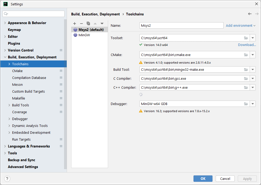
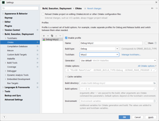
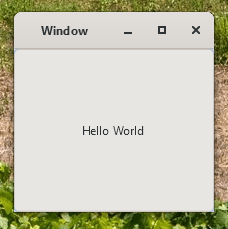

# gtk4-windows11-clion
Windows 11 example applications based on GTK4 using MSYS2 and CLion

This is a basic *HelloWorld* project for GTK4 on Windows. It is a regular CMake project and should be buildable on any number of platforms.

Having said that, the tech stack I used for it consists of:
- the CLion IDE
- a toolchain based on Msys2 and MinGW64

## Instructions for windows

Download and install Msys2 from [msys2.org](https://www.msys2.org/). Then, open an Msys2 shell and install all build tools and libraries needed: 
```shell
pacman -S mingw-w64-x86_64-gtk4 &&
pacman -S mingw-w64-x86_64-toolchain
```

Next, configure the toolchain. Go to **Settings > Build, Execution, Deployment > Toolchains** and configure your toolchain as shown in the image below.



If you did not make the Msys2 toolchain the default toolchain, go to **Settings > Build, Execution, Deployment > CMake ** and set the Msys2 toolchain there.



If all is installed and configured correctly, you can build and run your program by pressing *Shift-F10*:

